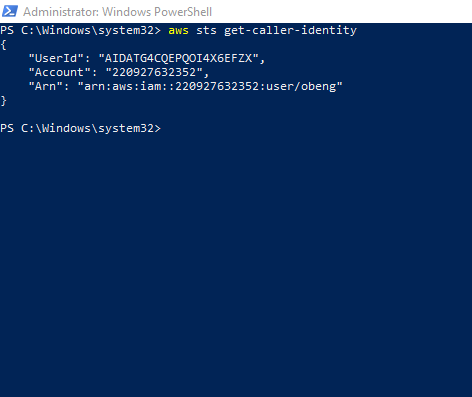

# Week 0 — Billing and Architecture

## Week 0 Assignment ##

# Lucid diagram for Architecture #


## Process involved during Installing AWS CLI ##
1.The CLI instaaltion process was referenced from this website !(https://docs.aws.amazon.com/cli/latest/userguide/getting-started-install.html)
2. After choosing the windows version, I installed it with this command ```msiexec.exe /i https://awscli.amazonaws.com/AWSCLIV2.msi ```
3. Poweshell with administrative right was used to install it 
4. Finally I checked it's availability with this command 
