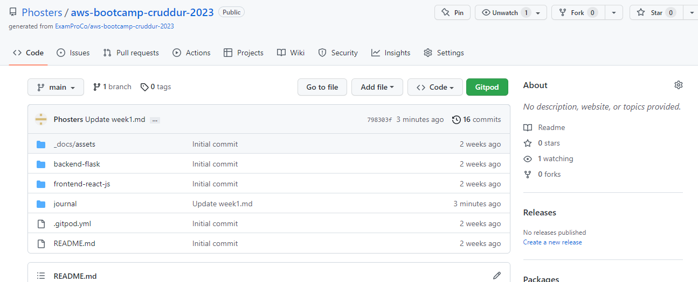
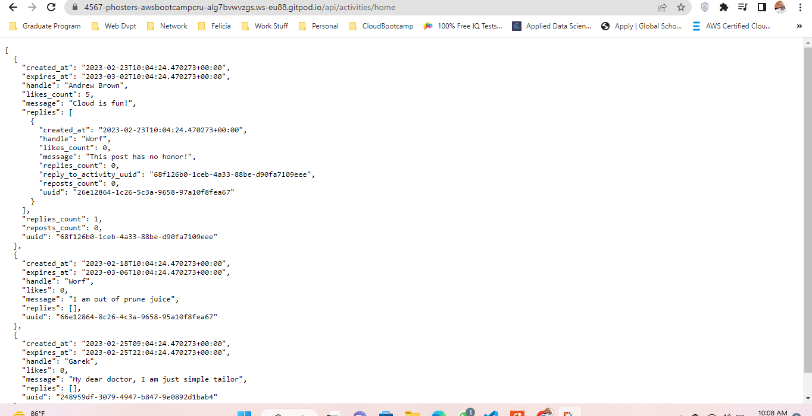

# Week 1 — App Containerization

## Week 1 Summary

In Week one, I will be containerizing crudder app: 
1. I will first make sure that gitpod is connected to my github to leverage on gitpod's dev-as-service properties 
2. After that, I will make sure that my backend is also containerized with docker
3. I will containerize the frontend with docker 
4. Next, I will use docker compose to manage multiple conatiner ie; the frontend and the backed end
5. Finally, I will Integrate app with a database


## Connecting Gitpod to Github:

### Reference: [Link to reference](https://www.gitpod.io/docs/configure/authentication/github)
1. I logged onto my Github repository and locted my Cruddur repo
2. Infront of my repo URL I inserted this ```gitpod.io/``` connecting my Github to Gitpod
3. I clicked on gipod to locate my workspace to see everything is fine in there
4. The entire Crudder app repo was there just like Github




## Containerzing the Backend of Crudder:

NB: I added the extension for docker in Gitpod first.
After that, we will install flask which is used for developing web applications using python. Advantages of using Flask framework are: There is a built-in development server and a fast debugger provided [More information on Flask](https://www.analyticsvidhya.com/blog/2021/10/easy-introduction-to-flask-framework-for-beginners/)


### Create a docker file for the backend and run it locally

After that install th python libraries for your backend ```pip3 install -r requirements.txt```
Set your environment variables, with this app we set 2 variables for backend and frontend with this 
```export FRONTEND_URL="*"``` and ```export BACKEND_URL="*"```

After installing your evironment variables, you install your backend app framework with this, in our case is flask 
``` python3 -m flask run --host=0.0.0.0 --port=4567 ```
check the ports and open it ie; the padlock and then open to see it, your app points to ```/api/activities/home``` so append it to the URL before it works

Now you can kill your process ie; stop running your app with this ```Ctrl + c ```

I used this command to install flask which will run on port 4567, at this point is necessary to note which port your container will be running on, it helps to identify possible errors when running multiple containers
in summary for the above below is the compiled code

```
cd backend-flask
export FRONTEND_URL="*"
export BACKEND_URL="*"
python3 -m flask run --host=0.0.0.0 --port=4567
cd ..

```

### With this knowledge, we will then run this app in a container for the backend

locate the backend and create a docker file by name ```dockerfile``` 
The dockerfile allows us to run our containers, in other words, an image would be generated from this file to run our container
Make sure to be in the backend and then paste your docker file command, in our case is this

```
FROM python:3.10-slim-buster

WORKDIR /backend-flask

COPY requirements.txt requirements.txt
RUN pip3 install -r requirements.txt

COPY . .

ENV FLASK_ENV=development

EXPOSE ${PORT}
CMD [ "python3", "-m" , "flask", "run", "--host=0.0.0.0", "--port=4567"] 

```

Because manually set the frontend and backend environment, we will have to unset them before we run our container
this is the command to unset them: ``` unset FRONTEND_URL ``` and then check if it exist/search with the grep command ``` env | grep FRONTEND ```
                                    ``` unset BACKEND_URL ``` and then check if it existwith the grep command  ``` env | grep BACKEND ```

We are now set to build our docker; we have two options either to build with our root or backend flask, in this tutorial we will use the root so be in the root
To build the image for the backend, use this command to locate the docker file within backend flask with name backend-flask
``` docker build -t  backend-flask ./backend-flask ```
To confirm you have backend-flask as an image in gitpod, locate it at Dockerand you can run ``` docker images ``` to show you your images
Now lets run our docker  ``` docker run --rm -p 4567:4567 -e FRONTEND_URL="*" -e BACKEND_URL="*" -it backend-flask ``` and appen it with this ```/api/activities/home``` in the URL in order to be active
Our backend is now working but since we didnt detach it during installation, ctrl+cwill kill it

### Now lets build the frontend
Create a docker file in the frontend ie ``` dockerfile ```, in the dockerfile paste this command

``` 
FROM node:16.18

ENV PORT=3000

COPY . /frontend-react-js
WORKDIR /frontend-react-js
RUN npm install
EXPOSE ${PORT}
CMD ["npm", "start"]

```

After that run an npm for packages/ modules needed within the frontend with this 

```
npm install 
```

Now go back to your root directory and build your image from the dockerfile in the frontend with this: 

```
docker build -t frontend-react-js ./frontend-react-js
```

Lets run the frontend image with this,

```
docker run -p 3000:3000 -d frontend-react-js

```

Our frontend will be up and running now, but because we want to manage it with docker-compose we will kill it with 

``` 
docker stop containerID

```

### Now let us write a compose.yml file to run both the fonrtend and back end
First create a compose.yml file in the root directory with this name ```docker-compose.yml ```
Now lets copy and paste its contents into it with this:

```
version: "3.8"
services:
  backend-flask:
    environment:
      FRONTEND_URL: "https://3000-${GITPOD_WORKSPACE_ID}.${GITPOD_WORKSPACE_CLUSTER_HOST}"
      BACKEND_URL: "https://4567-${GITPOD_WORKSPACE_ID}.${GITPOD_WORKSPACE_CLUSTER_HOST}"
    build: ./backend-flask
    ports:
      - "4567:4567"
    volumes:
      - ./backend-flask:/backend-flask
  frontend-react-js:
    environment:
      REACT_APP_BACKEND_URL: "https://4567-${GITPOD_WORKSPACE_ID}.${GITPOD_WORKSPACE_CLUSTER_HOST}"
    build: ./frontend-react-js
    ports:
      - "3000:3000"
    volumes:
      - ./frontend-react-js:/frontend-react-js
      
```
#### the name flag is a hack to change the default prepend folder
#### name when outputting the image names

```
networks: 
  internal-network:
    driver: bridge
    name: cruddur
    
```

After this lets run our docker compose with this ``` docker-compose up -d ```


### Finally we conclude with database
Now we willbe connecting Postgress(sql) and DynamoDB(Nosql) to our docker-compose
First copy dynamoDB local under the docker-compose file ie; add it to the bottom of the docker-compose file
Lets start with the commands for postgress:NB: DONT COPY THE SERVICES

```
services:
  db:
    image: postgres:13-alpine
    restart: always
    environment:
      - POSTGRES_USER=postgres
      - POSTGRES_PASSWORD=password
    ports:
      - '5432:5432'
    volumes: 
      - db:/var/lib/postgresql/data

```

check from the latter part and take off the volumes which we will paste it after everything to make our code more readeable ie; after the databases, then we move to volumes

After we are done with this, we add DynamoDB with this right after postgress: NB: DONT COPY THE SERVICES

```
services:
  dynamodb-local:
    # https://stackoverflow.com/questions/67533058/persist-local-dynamodb-data-in-volumes-lack-permission-unable-to-open-databa
    # We needed to add user:root to get this working.
    user: root
    command: "-jar DynamoDBLocal.jar -sharedDb -dbPath ./data"
    image: "amazon/dynamodb-local:latest"
    container_name: dynamodb-local
    ports:
      - "8000:8000"
    volumes:
      - "./docker/dynamodb:/home/dynamodblocal/data"
    working_dir: /home/dynamodblocal
    
  ```
    
  Finally we add the volumes beneath everything to detach if from the app and databases commands. 
  With that, insert this:
 NB: Notice we have a pending volume from the database so we will insert it here and add the rest
 
 ```
 volumes:
  db:
    driver: local
  
  ```
    
Now run the docker compose for our container  ``` docker-compose up -d ```
Open the ports for the frontend, backend and database
reference to frontend and backend





### Checking database
Once the ports are opened, type aws in the command to see whether you have aws cli installed
After that create a table and insert the data you want to work with

### Challenges
When copying the databse commands into the docker-compose yaml file, I copied it with services which gave me an error ie; ``` map key be unique ```
After reading an article about it I resolved the issued reference [Link to map key in yaml](https://stackoverflow.com/questions/71192632/error-map-keys-must-be-unique-while-using-yaml-extension-field-in-docker-compose) 
  
 


