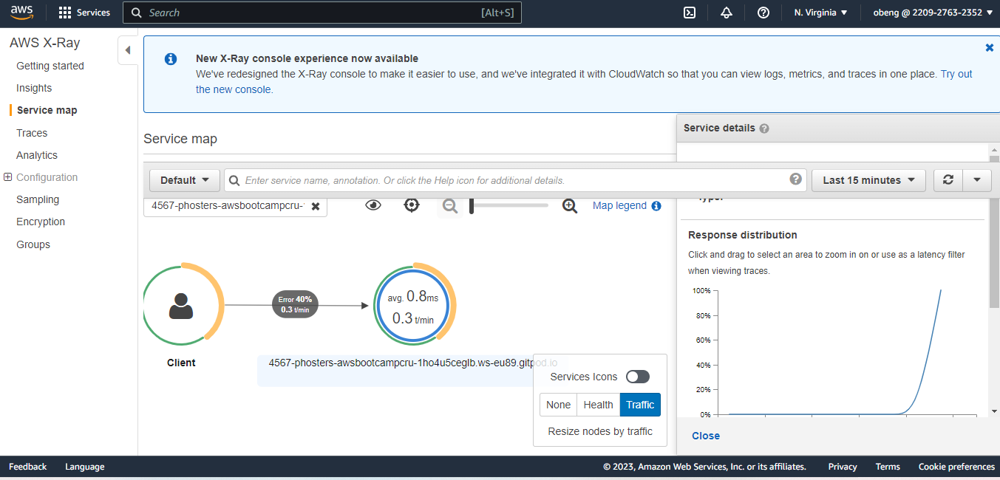

# Week 2 — Distributed Tracing

### Distributed Tracing
Distributed tracing is a method of tracking application requests as they flow from frontend devices to backend services and databases. Developers can use distributed tracing to troubleshoot requests that exhibit high latency or errors.
With this our focus will be on Observability.
Observability is the extent to which you can understand the internal state or condition of a complex system based only on knowledge of its external outputs.
Observability has three pillars whuch helps in analyzing and tracing events in our application which are  Logs, metrics and traces.

This week focuses on the use of some tool we will use to perform observability in our application
These tools are :
- Honeycomb
- AWS X-ray
- AWS Cloud watch logs
- Roll bar

### Honeycomb Instrumentation in the Backend Flask
To begin with. lets export opentelemetry sdk and tools into our backend within the requirements file ie ``` requirements.txt ``` with this :

```
opentelemetry-api 
opentelemetry-sdk 
opentelemetry-exporter-otlp-proto-http 
opentelemetry-instrumentation-flask 
opentelemetry-instrumentation-requests

```

now lets install the dependencies for this in the backend :

```
pip install -r requirements.txt

```

In the app, ie the app.py for in the backend, we will impr the tools in the requirements

```
from opentelemetry import trace
from opentelemetry.instrumentation.flask import FlaskInstrumentor
from opentelemetry.instrumentation.requests import RequestsInstrumentor
from opentelemetry.exporter.otlp.proto.http.trace_exporter import OTLPSpanExporter
from opentelemetry.sdk.trace import TracerProvider
from opentelemetry.sdk.trace.export import BatchSpanProcessor

```

After that, we will Initialize tracing and an exporter that can send data to Honeycomb with this :

```
provider = TracerProvider()
processor = BatchSpanProcessor(OTLPSpanExporter())
provider.add_span_processor(processor)
trace.set_tracer_provider(provider)
tracer = trace.get_tracer(__name__)

```

then Initialize automatic instrumentation with Flask:

```
app = Flask(__name__)
FlaskInstrumentor().instrument_app(app)
RequestsInstrumentor().instrument()

```

after this, add the env variables for the honeycomb in the docker compose env part with thi replacing the api keyfrom honeycomb adn service name as backend-flask:

```
OTEL_EXPORTER_OTLP_ENDPOINT: "https://api.honeycomb.io"
OTEL_EXPORTER_OTLP_HEADERS: "x-honeycomb-team=${HONEYCOMB_API_KEY}"
OTEL_SERVICE_NAME: "${HONEYCOMB_SERVICE_NAME}"

```

Finally lets export the API keys and service name with this:

```
export HONEYCOMB_API_KEY=""
export HONEYCOMB_SERVICE_NAME="Cruddur"
gp env HONEYCOMB_API_KEY=""
gp env HONEYCOMB_SERVICE_NAME="Cruddur"

```

Now check from honeycomb for your instrumentation

### AWS X-Ray Instrumentation 

Export the region you would want to work in, in my case I will use North Virginia with this:

```
export AWS_REGION="us-east-1"

```

In the context of Amazon Web Services (AWS), the AWS_REGION environment variable is used to specify the AWS region that an AWS client or SDK should connect to. The value "us-east-1" represents the US East (N. Virginia) region in AWS, which is one of the most commonly used regions in the platform, would do that with this:

```

gp env AWS_REGION="us-east-1"

```

Lets begin with installing AWS CLI and the framework for the frontend within the gitpod.yaml file:
These tasks are part of a configuration file for a tool called "Theia" that allows developers to run a cloud-based Integrated Development Environment (IDE). The tasks are defined using the YAML syntax and describe two separate jobs that will be executed sequentially.

The first job, named "aws-cli", sets up the AWS Command Line Interface (CLI) in the environment. It defines an environment variable called "AWS_CLI_AUTO_PROMPT" with a value of "on partial", which enables automatic prompting for certain CLI commands. It also includes an "init" section that contains shell commands to be run before the job executes. These commands do the following:

Change the current working directory to "/workspace".
Download the AWS CLI installation archive from the AWS website using the "curl" command.
Unzip the archive and install the AWS CLI using the "sudo" command.
Change the current working directory back to the root of the Theia workspace.
The second job, named "react-js", installs the React.js frontend framework in the environment. It contains a "command" section that specifies shell commands to be executed. These commands do the following:

Change the current working directory to the "frontend-react-js" directory.
Install the necessary Node.js packages using the "npm -install" command.
Overall, these tasks automate the setup of two important development tools - the AWS CLI and the React.js framework - so that they are readily available for use in the cloud-based IDE.
Do this with this code within the gitpod.yaml

```
tasks:
- name: aws-cli
  env: 
    AWS_CLI_AUTO_PROMPT: on partial 
    init: |
      cd /workspace
      curl -fSsl "https://awscli.amazonaws.com/awscli-exe-linux-x86_64.zip" -o "awscliv2.zip"
      unzip -qq awscliv2.zip
      sudo ./aws/install --update
      cd $THEIA_WORKSPACE_ROOT
- name: react-js
  command: |
   cd frontend-react-js
   npm -install
   
```

Locate the frontend and install npm with this ``` npm install ```

Now install the AWS SDK in the requirements.txt document in the backend where we will be instrumenting with this : ``` aws-xray-sdk ```

Within the backend install the update that has happened within the requirement document with this: ``` pip install -r requirements.txt ```

Lets open the application in the backend with name app.py and insert the code to import and install the sdk, make sure to change service name to backend flask

```
from aws_xray_sdk.core import xray_recorder
from aws_xray_sdk.ext.flask.middleware import XRayMiddleware

xray_url = os.getenv("AWS_XRAY_URL")
xray_recorder.configure(service='Cruddur', dynamic_naming=xray_url)
XRayMiddleware(app, xray_recorder)

```
Creats a json file in aws file for x-ray resources with name xray.json and change the service name to ``` backend-flask ```

```
{
  "SamplingRule": {
      "RuleName": "Cruddur",
      "ResourceARN": "*",
      "Priority": 9000,
      "FixedRate": 0.1,
      "ReservoirSize": 5,
      "ServiceName": "Cruddur",
      "ServiceType": "*",
      "Host": "*",
      "HTTPMethod": "*",
      "URLPath": "*",
      "Version": 1
  }
}

```

Now lets create our x-ray group with this, making sure you update the service name to backend-flask, and run in the backend flask, 

```
aws xray create-group \
   --group-name "Cruddur" \
   --filter-expression "service(\"backend-flask\")"
```
Log on to AWS console and check from xray that ``` cruddur ``` has been created

Now lets add daemon sampling rule to see data

```
aws xray create-sampling-rule --cli-input-json file://aws/json/xray.json

```

We install our r-ray daemon file to docker compose fle with this

```
  xray-daemon:
    image: "amazon/aws-xray-daemon"
    environment:
      AWS_ACCESS_KEY_ID: "${AWS_ACCESS_KEY_ID}"
      AWS_SECRET_ACCESS_KEY: "${AWS_SECRET_ACCESS_KEY}"
      AWS_REGION: "us-east-1"
    command:
      - "xray -o -b xray-daemon:2000"
    ports:
      - 2000:2000/udp
  ```
  
  After that, add it's environment variables in the docker compose with this
  
 ```
   AWS_XRAY_URL: "*4567-${GITPOD_WORKSPACE_ID}.${GITPOD_WORKSPACE_CLUSTER_HOST}*"
   AWS_XRAY_DAEMON_ADDRESS: "xray-daemon:2000"

```
  
check the service data for the last 10 mins with this:

```
EPOCH=$(date +%s)
aws xray get-service-graph --start-time $(($EPOCH-600)) --end-time $EPOCH

```

Now login to AWS console to cheack traces from your xray:




### Cloudwatch logs 
CloudWatch Logs enables you to centralize the logs from all of your systems, applications, and AWS services that you use, in a single, highly scalable service.
First we will start with adding watchtower to our backend within the requirement file

```
watchtower

```

After that, we will install the requirements file to install the watchtower

```
pip install -r requirements.txt

```

In the app.py in the backend, we will add this to the backend

```
import watchtower
import logging
from time import strftime

```

After that, we will configure the app to use cloudwacth logger by adding this to the app.py

```
LOGGER = logging.getLogger(__name__)
LOGGER.setLevel(logging.DEBUG)
console_handler = logging.StreamHandler()
cw_handler = watchtower.CloudWatchLogHandler(log_group='cruddur')
LOGGER.addHandler(console_handler)
LOGGER.addHandler(cw_handler)
LOGGER.info("some message")

```

And this one too:

```
@app.after_request
def after_request(response):
    timestamp = strftime('[%Y-%b-%d %H:%M]')
    LOGGER.error('%s %s %s %s %s %s', timestamp, request.remote_addr, request.method, request.scheme, request.full_path, response.status)
    return response
```


